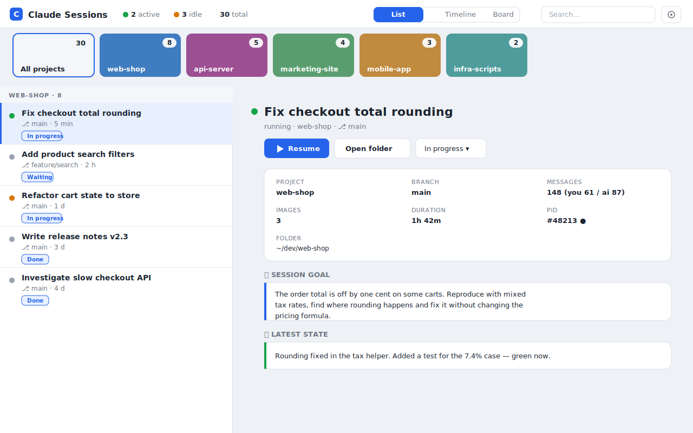
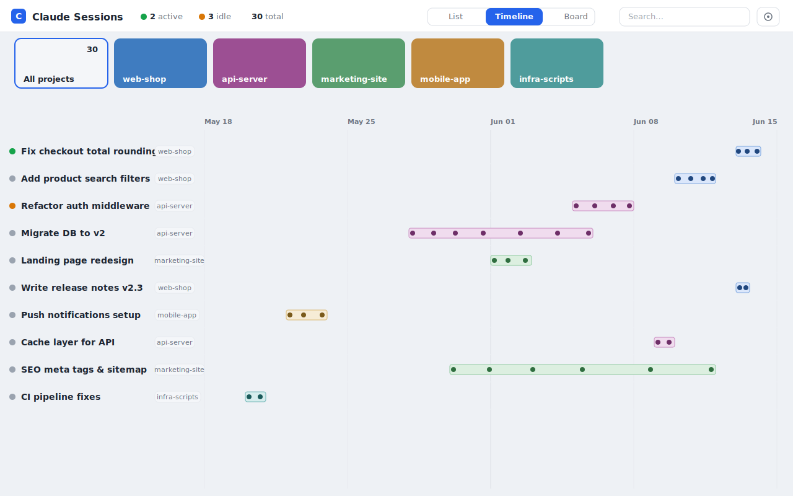
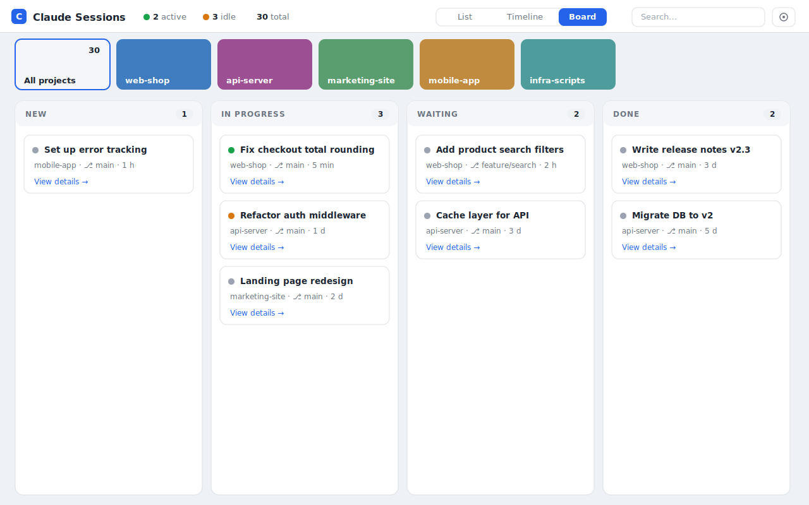

# 🗂️ Claude Session Manager

> A local, zero‑dependency web dashboard to find, overview and manage **all your Claude Code sessions** across every folder on your machine — including the ones you started and forgot.


Claude Code stores every session centrally under `~/.claude`. Once you work across many
projects, it gets hard to remember **what you started, where, and whether it's still running.**
This tool reads that data (read‑only) and gives you one clean overview — as a **list**, a
**timeline**, or a **kanban board**.

> ⚠️ Unofficial community project. Not affiliated with or endorsed by Anthropic.

---

## Screenshots

**List + detail** — all sessions grouped by project, with a rich detail panel:



**Timeline** — an absolute time axis showing when each session ran, with activity markers:



**Board** — drag sessions across your own kanban columns:



---

## Why?

- You start a Claude Code session in some project, get interrupted, and **forget it's still running**.
- You can't remember **which folder** a session was in, or **what it was about**.
- You want a bird's‑eye view of **everything you've worked on** and its current state.

Claude Session Manager solves exactly that.

## Features

- 🟢 **Live status** — see which sessions are actually running (🟢), idle (🟡) or closed (⚫), via a real process check.
- ☰ **List + detail** — sessions grouped by project; click for a rich detail panel:
  - 🎯 **Goal** (first prompt) and 📍 **latest state** (last prompt) — an instant summary, no AI call needed.
  - 💬 full **prompt history**, 🖼️ **image gallery** (screenshots pasted into the session), message counts, duration, branch, PID, folder.
- ⧗ **Timeline (Gantt)** — a single absolute time axis (years → months → days) showing **when** each session ran, with prompt markers for activity.
- ▦ **Board (Kanban)** — drag sessions across your own columns to organize your workflow.
- 🎴 **Visual project filter** — project tiles with a representative image (or color).
- ▶ **Resume** a forgotten session in a new terminal, 📂 **open its folder**, 📝 add **notes**.
- 🌗 **Light & dark theme**, 🌍 **multi‑language** (English/German included), all configurable.
- 🔌 **Config‑first** — almost everything is driven by a settings schema (a stepping stone toward a plugin system).

## How it works

It reads, **read‑only**, from your local `~/.claude` directory:

| Source | Used for |
|---|---|
| `~/.claude/sessions/<pid>.json` | running sessions (live status) |
| `~/.claude/projects/*/*.jsonl` | transcripts → titles, goal, prompts, images, timing |

Your own data (kanban columns, notes) is stored in a separate sidecar file
(`~/.claude/session-manager-state.json`). **The original Claude Code files are never modified.**

## Privacy

- 100% **local**. Nothing is uploaded anywhere — it's a plain Node HTTP server on `localhost`.
- The web UI is only served to your machine (default `http://localhost:4317`).
- Read‑only access to your sessions; writes go only to its own sidecar/config files.

## Requirements

- [Node.js](https://nodejs.org) **18+** (tested on 22). No npm install, **no dependencies**.

## Install & run

```bash
git clone https://github.com/<you>/claude-session-manager.git
cd claude-session-manager
node server.js
```

Then open <http://localhost:4317>.

**Windows:** double‑click `start.bat` (starts the server and opens your browser).
Use `stop.bat` to stop it.

Custom port: `PORT=5000 node server.js` (or set it in the settings).

## Configuration

Open ⚙ in the top‑right. Everything is stored in `~/.claude/session-manager-config.json`.

- **Language**, **theme** (light/dark), **start view**, **auto‑refresh interval**, **server port**
- **Kanban columns** (freely definable)
- **Terminal used for “Resume”** — presets per platform with a live preview:
  - Windows: PowerShell, cmd, Windows Terminal
  - macOS: Terminal.app, iTerm
  - Linux: gnome‑terminal, konsole, xterm
  - …or a **custom command** with `{cwd}` and `{id}` placeholders.

### Adding a language

Copy `lang/en.json`, translate the values, set `"_name"` (e.g. `"Français"`), save as
`lang/fr.json` — it appears in the language picker automatically. No code changes. PRs welcome!

## Roadmap

- 🧠 **Support more AI assistants**, not just Claude Code — pluggable “session providers” for
  other coding agents/CLIs (e.g. tools that keep local session/transcript data).
- 🔍 **Full‑text search** across all transcripts.
- 🔔 **Notifications** for forgotten/idle running sessions.
- 🌿 **Optional git status** per session folder (uncommitted changes, ahead/behind).
- 📈 **Activity pulse** (GitHub‑style) instead of single dots in the timeline.
- 🧩 **Plugin system** — contribute views, columns, commands and settings via drop‑in modules.

Ideas and feedback welcome — open an issue!

## Contributing

**Pull requests are welcome!** 🎉

- Small, focused PRs are easiest to review.
- New translations are especially appreciated (see “Adding a language”).
- For larger changes, open an issue first to discuss the direction.

The whole app is intentionally tiny and dependency‑free: a single `server.js`, a single
`index.html`, and `lang/*.json`. Easy to read, easy to hack.

## License

[MIT](LICENSE) — do whatever you like, no warranty.
